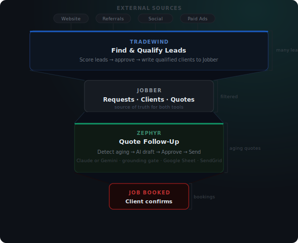
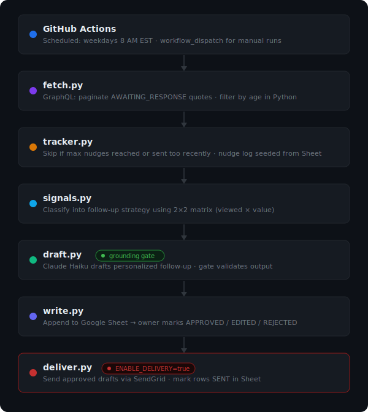
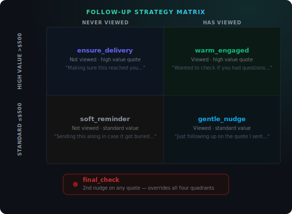

# Zephyr
> AI-powered quote follow-up automation for Jobber

## What It Does

Home service pros send quotes from Jobber and go back on the truck — nobody's tracking which quotes got ignored. Zephyr runs on a schedule, finds every aging quote in your Jobber account, and uses Claude to draft a personalized follow-up message for each one. You review the drafts in a Google Sheet and decide what to send.

Industry data: **48% of quotes are never followed up on.** The first business to follow up wins the job **78% of the time.**

---

## Part of the Jobber Automation Suite



| | [Tradewind](https://github.com/zenobioscastillo1-source/Nerumi-Jobber-Tradewind) | Zephyr |
|---|---|---|
| **Stage** | Top of funnel — finding leads | Middle — converting quotes |
| **Direction** | External → Jobber | Jobber → follow-up drafts |
| **Trigger** | On-demand | Scheduled (cron / GitHub Actions) |
| **AI task** | Lead qualification | Communication drafting |

---

## How It Works

### Pipeline



### Strategy Matrix

The `clientHubViewedAt` field tells you if a client opened the quote link. Zephyr uses that plus the quote value to pick the right tone:



A second nudge on any quote uses the `final_check` strategy — a brief, respectful last attempt before moving on.

---

## Install

```bash
git clone https://github.com/zenobioscastillo1-source/Jobber-Zephyr
cd Jobber-Zephyr
python -m venv .venv
source .venv/bin/activate  # Windows: .venv\Scripts\activate
pip install -r requirements.txt
cp .env.example .env
# Fill in your credentials in .env
python -m src.main
```

---

## Configuration

| Variable | Default | Description |
|----------|---------|-------------|
| `JOBBER_ACCESS_TOKEN` | — | Jobber OAuth access token (refreshed each run) |
| `JOBBER_REFRESH_TOKEN` | — | Jobber OAuth refresh token (permanent; store in Secrets) |
| `JOBBER_CLIENT_ID` | — | Jobber app client ID |
| `JOBBER_CLIENT_SECRET` | — | Jobber app client secret |
| `AGING_THRESHOLD_DAYS` | `3` | Quote must be this many days old to trigger follow-up |
| `MAX_NUDGES_PER_QUOTE` | `2` | Max follow-up attempts per quote |
| `MIN_DAYS_BETWEEN_NUDGES` | `3` | Minimum gap between nudges on the same quote |
| `HIGH_VALUE_THRESHOLD` | `500` | Dollar amount separating high-value from standard quotes |
| `GOOGLE_SHEETS_CREDENTIALS` | — | Service account JSON (raw string or file path) |
| `GOOGLE_SHEET_ID` | — | Google Sheet ID for approval surface |
| `ANTHROPIC_API_KEY` | — | Anthropic API key for Claude draft generation |
| `BUSINESS_NAME` | — | Your business name (appears in AI-generated drafts) |
| `OWNER_NAME` | — | Your name (sign-off on all drafts) |
| `SENDGRID_API_KEY` | — | SendGrid API key (required when `ENABLE_DELIVERY=true`) |
| `FROM_EMAIL` | — | Sender email address for outbound drafts |
| `ENABLE_DELIVERY` | `false` | Set to `true` to auto-send approved drafts via SendGrid |

### Google Sheet Setup

Create a Google Sheet with two tabs:
- **Pending Drafts** — Zephyr writes here; you review and set Status to `APPROVED`, `EDITED`, or `REJECTED`
- **Nudge Log** — Running history of all follow-ups (also used to seed nudge state across runs)

Share the sheet with the service account email from your credentials JSON.

---

## Design Decisions

**Why read-only by default (no auto-send)**
Sending an unsanctioned email is a relationship risk. Set `ENABLE_DELIVERY=false` (the default) to keep the owner in the loop for every message. Opt in to live sending with `ENABLE_DELIVERY=true`.

**Why JSON tracker over a database**
A single JSON file keeps the project self-contained. The Nudge Log Sheet tab seeds this file on each run, so state persists across GitHub Actions runs without any extra infrastructure.

**Why the grounding gate blocks discount offers**
The AI has no knowledge of what the owner is authorized to offer. A draft that says "I can give you 10% off" sends a promise the owner never made. The gate hard-blocks this class of output.

**Why $500 is the value threshold default**
In home services, $500 is roughly the line between a quick service call and a project-sized quote. Higher-value quotes deserve a warmer tone — more at stake, more likely the client is genuinely considering. Tune via `HIGH_VALUE_THRESHOLD`.

**Why the "don't reveal tracking" rule exists**
Telling a client "I see you opened the quote" is a relationship killer. Jobber's `clientHubViewedAt` is an internal signal that improves the *tone* of the follow-up — it's never surfaced in the message itself.

---

## Testing

```bash
pytest tests/ -v
```

| File | Covers |
|------|--------|
| `test_fetch.py` | Aging filter, pagination, filtering out recent quotes |
| `test_signals.py` | All 5 strategies, edge cases (zero-dollar, null name, custom threshold) |
| `test_draft.py` | Grounding gate catches all 3 FAIL categories; WARN on long drafts; LLM mocked |
| `test_tracker.py` | Max nudge enforcement, min-days interval, Sheet seed, record/save/load roundtrip |
| `test_deliver.py` | Approved row filtering, SendGrid send, SENT row marking |

All tests run without live API calls — Jobber, Anthropic, Google Sheets, and SendGrid are monkeypatched.

---

## Roadmap

- [x] **Phase 2:** Email delivery via SendGrid (`ENABLE_DELIVERY=true`)
- [x] **Sheet-seeded nudge log:** Nudge state persists across GitHub Actions runs via Nudge Log tab
- [ ] **Webhook mode:** React to quote status changes in real time instead of polling
